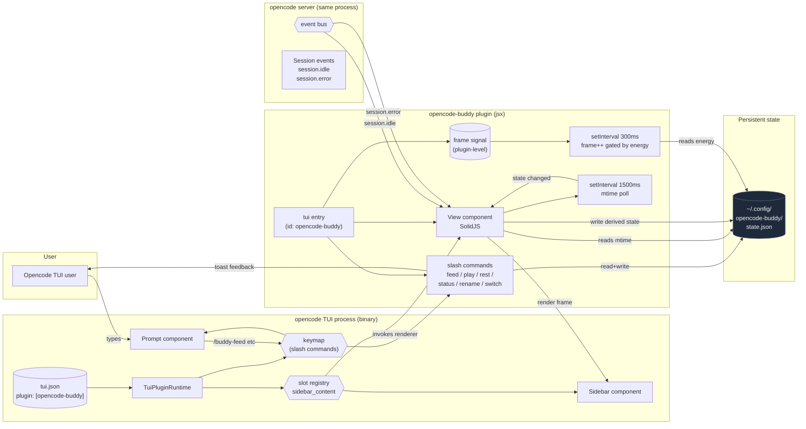

# opencode-buddy

A virtual ASCII pet companion that lives in the opencode TUI sidebar. Hatches, feeds, plays, and reacts to what you're coding — all without leaving opencode.

[Demo video](assets/buddy-demo.mov)

```
┌──────────────────────────┐
│  opencode TUI            │
│                          │
│  > your prompt here      │
│                          │
│         sidebar          │
│ ┌──────────────────────┐ │
│ │ Quack the duck       │ │
│ │       __             │ │
│ │     <(o )___         │ │
│ │      ( ._> /         │ │
│ │       `--'           │ │
│ │ ──────────────────── │ │
│ │ hunger ████████░░ 79 │ │
│ │ happy  ████████░░ 79 │ │
│ │ energy ██████████ 100│ │
│ │ idle · Lv 1 · xp 0   │ │
│ └──────────────────────┘ │
└──────────────────────────┘
```

The buddy renders inside the TUI sidebar, reacts to your coding sessions (cheering when a turn finishes, getting scared on errors, falling asleep when low on energy), and can be controlled via slash commands typed directly in the prompt.

> **Watch the demo:** [assets/buddy-demo.mov](assets/buddy-demo.mov) — a 640×480 screen recording showing the buddy in the sidebar with slash commands in action.

## Install

Requires opencode ≥ 1.15.

```bash
npm install -g opencode-buddy
```

The `postinstall` script automatically registers the plugin in both config files using the same spec. opencode picks the right entrypoint from the package's `exports` field based on runtime kind:

- `opencode.json` (kind: `server`) → `src/server-plugin.js` via `main` (no-op since 0.3.x)
- `tui.json` (kind: `tui`) → `src/tui-plugin.jsx` via `exports["./tui"]`

Both `~/.config/opencode/opencode.json` and `~/.config/opencode/tui.json` get the same `plugin: ["opencode-buddy"]` entry. The `postinstall` is JSONC-safe — it leaves any file that contains comments alone and asks you to add the entry manually:

```jsonc
// ~/.config/opencode/opencode.json
{
  "plugin": ["opencode-buddy"]
}
```

```jsonc
// ~/.config/opencode/tui.json
{
  "$schema": "https://opencode.ai/tui.json",
  "plugin": ["opencode-buddy"]
}
```

Restart opencode. The buddy appears in the sidebar.

## Usage

Once installed, type `/` in the prompt to see the slash commands. The buddy ships with six:

| Slash command | Effect |
| --- | --- |
| `/buddy` | Show the buddy's current stats as a toast |
| `/buddy-feed` | Feed the buddy (+25 hunger, -5 energy) |
| `/buddy-play` | Play with the buddy (+20 happiness, +5 xp, -5 hunger) |
| `/buddy-rest` | Let the buddy rest (+30 energy) |
| `/buddy-rename` | Open a prompt to rename the buddy (max 20 chars) |
| `/buddy-switch` | Open a picker to switch to duck, cat, dragon, axolotl, robot, or ghost |

The buddy also reacts passively to your sessions:

- `session.idle` → 4 second **celebrating** state
- `session.error` → 5 second **scared** state
- Energy < 20 → automatically transitions to **sleeping** (animation pauses)
- Hunger < 25 → transitions to **scared** for 30 seconds

State is shared across all opencode sessions via `~/.config/opencode-buddy/state.json`. Open a session in a different terminal and your buddy is still there.

### What you see in the sidebar

The sidebar shows the buddy's species-specific ASCII art, plus four lines under it:

```
[BDDY]  Quack the cat        <- species + name (preceded by a rotating status dot)
<art rows>                     <- 6 rows of the species art
hunger |████░░░░░░| 79         <- hunger bar
happy  |███░░░░░░░| 60         <- happiness bar
energy |███████░░░| 70         <- energy bar
idle  Lv1  xp5/50              <- state label + level + xp progress
```

The bottom state label reflects the persisted `state` field in `state.json`. It changes on `session.idle` (4 s "celebrating"), `session.error` (5 s "scared"), and on energy/hunger thresholds (auto "sleeping" or "scared"). The art's idle state has 3 frames; the sidebar re-renders the current frame each time `state.json` is reloaded.

## Six species

```
        duck                    cat                  dragon
          __                /\_/\                  /^^\
        <(o )___          ( o.o )                (o o)  ~~
         ( ._> /           > ^ <                  >w<    ~
          `--'            /|   |\                /| |\
       ~ idle ~         (_|   |_)               (_| |_)
                           meow                   rawr

      axolotl                robot                  ghost
       ^___^              [ O . O ]              .-"-"-.
      (o . o)             /|#####|\              ( o . o )
     \|_|_|/             / |#####| \             | ~  ~ |
      \| |/               |     |                |     |
       ) (               /| | | |\               \uuuuu/
     ~ ambien              beep                   boo
```

Each species has a per-character color palette. The idle state has 3 frames; `frameCount` is exposed so the View can pick a frame to render. The buddy renders whatever frame `frame() % fc()` returns at the moment of re-render.

## Architecture



### Boot flow

1. opencode reads `~/.config/opencode/tui.json` and discovers the buddy entry under `plugin`.
2. The TUI runtime loads `tui-plugin.jsx` from `opencode-buddy` (via `exports["./tui"]` in `package.json`).
3. The `tui(api)` function runs once. It does three things:
   - Sets up a **plugin-level frame signal** and a `setInterval` (300 ms) that ticks it. The frame signal is passed into the View as a prop, so the View is purely a consumer — its own lifecycle does not own the timer. This means slot re-renders cannot freeze the animation.
   - Registers the `sidebar_content` slot. The slot renderer is cached on first call so the View instance is reused across re-renders.
   - Registers 6 slash commands on the keymap.
4. The TUI's `<Slot name="sidebar_content" />` (in the sidebar component) resolves to the buddy's cached `View`. The View reads the frame signal and re-renders the buddy art on every tick.
5. The View also runs a 1500 ms timer that polls `state.json` mtime. When the file changes, the View reloads and re-renders. Slash commands write to `state.json` directly, so the next poll picks up the change.
6. The `setInterval` for the frame signal also reads `state.json` each tick. If the buddy is `sleeping` or has energy < 20, the frame does not advance — the animation visually pauses while the buddy rests.

### Why two config files with the same spec?

opencode has separate plugin registries for the **server** (LLM tools, file watching) and the **TUI** (sidebar slots, slash commands, keybindings). When the same package spec appears in both, opencode looks at the package's `exports` field to pick the right entrypoint:

- `opencode.json` → `kind: "server"` → loads `src/server-plugin.js` via `main` (no-op since 0.3.x)
- `tui.json` → `kind: "tui"` → loads `src/tui-plugin.jsx` via `exports["./tui"]`

Slash commands update state instantly without round-tripping through the LLM, which is the right UX for "I want to feed my pet right now" interactions.

## Project layout

```
opencode-buddy/
├── package.json
├── README.md
├── LICENSE
├── scripts/
│   └── postinstall.mjs     # auto-registers plugin in opencode.json + tui.json
└── src/
    ├── tui-plugin.jsx     # TUI plugin: slot + slash commands + frame timer
    ├── server-plugin.js   # Server plugin: no-op (LLM tool removed in 0.3.x)
    ├── species.js         # ASCII art + per-species palettes + 3-frame idle loop
    ├── state.js           # state machine: tick, feed, play, rest, rename, switchSpecies, deriveState
    └── persistence.js     # atomic read/write of state.json
```

State is held at `~/.config/opencode-buddy/state.json`. `~/.config` resolves via `os.homedir()` so it works on Linux, macOS, and Windows.

## Uninstall

```bash
npm uninstall -g opencode-buddy
```

Then remove `"opencode-buddy"` from `opencode.json` and from `tui.json` (the npm uninstall does not auto-edit user config).

## License

MIT
