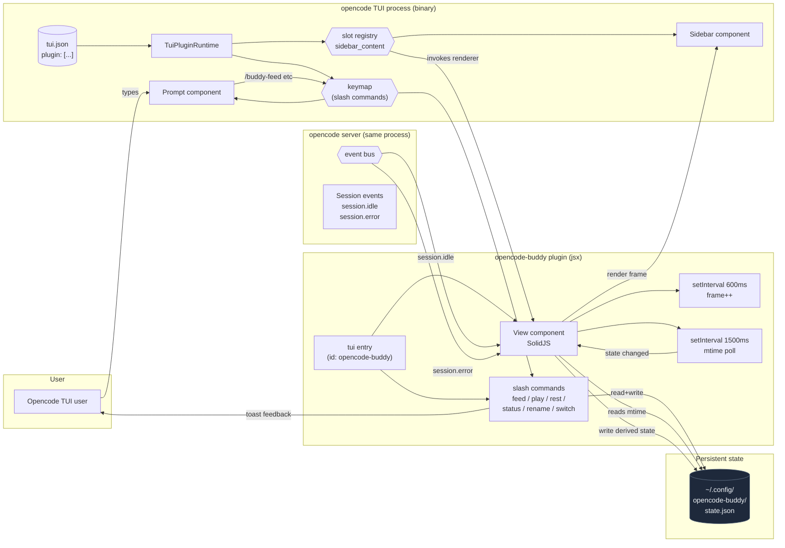

# opencode-buddy

A virtual ASCII pet companion that lives in the opencode TUI sidebar. Hatches, feeds, plays, and reacts to what you're coding — all without leaving opencode.

```
┌──────────────────────────┐
│  opencode TUI            │
│                          │
│  > your prompt here      │
│                          │
│         sidebar          │
│ ┌──────────────────────┐ │
│ │ Quack the duck       │ │
│ │       __             │ │
│ │     <(o )___         │ │
│ │      ( ._> /         │ │
│ │       `--'           │ │
│ │ ──────────────────── │ │
│ │ hunger ████████░░ 79 │ │
│ │ happy  ████████░░ 79 │ │
│ │ energy ██████████ 100│ │
│ │ idle · Lv 1 · xp 0   │ │
│ └──────────────────────┘ │
└──────────────────────────┘
```

The buddy blinks every 600ms, animates inside the TUI sidebar, and reacts to your coding sessions.

## Install

Requires opencode ≥ 1.15.

```bash
npm install -g opencode-buddy
```

Then enable it for both the server (tool registry) and the TUI (sidebar). The buddy ships two plugin entrypoints — `opencode-buddy` (server) and `opencode-buddy/tui` (TUI) — that must be declared in two different config files:

**`~/.config/opencode/opencode.json`** (server plugin)

```json
{
  "plugin": ["opencode-buddy"]
}
```

**`~/.config/opencode/tui.json`** (TUI plugin — newly created if it doesn't exist)

```json
{
  "$schema": "https://opencode.ai/tui.json",
  "plugin": ["opencode-buddy/tui"]
}
```

Restart opencode. The buddy appears in the sidebar.

## Usage

Once installed, type `/` in the prompt to see the slash commands. The buddy ships with six:

| Slash command | Effect |
| --- | --- |
| `/buddy` | Show the buddy's current stats as a toast |
| `/buddy-feed` | Feed the buddy (+25 hunger, -5 energy) |
| `/buddy-play` | Play with the buddy (+20 happiness, +5 xp, -5 hunger) |
| `/buddy-rest` | Let the buddy rest (+30 energy) |
| `/buddy-rename` | Open a prompt to rename the buddy (max 20 chars) |
| `/buddy-switch` | Open a picker to switch to duck, cat, dragon, axolotl, robot, or ghost |

The buddy also reacts passively to your sessions:

- `session.idle` → 4 second **celebrating** animation
- `session.error` → 5 second **scared** animation
- Energy < 20 → automatically transitions to **sleeping**
- Hunger < 25 → transitions to **scared** for 30 seconds

State is shared across all opencode sessions via `~/.config/opencode-buddy/state.json`. Open a session in a different terminal and your buddy is still there.

## Six species

```
        duck                    cat                  dragon
          __                /\_/\                  /\_/\
        <(o )___          ( o.o )                ( o o )  ~~
         ( ._> /           > ^ <                  > ^ < /
          `--'            /|   |\                /|   |\
       ~ idle ~         (_|   |_)               (_|   |_)
                           meow                   rawr

      axolotl                robot                  ghost
       ^___^              [ O . O ]              .-"-"-.
      (o . o)             /|#####|\              ( o . o )
     \|_|_|/             / |#####| \             | ~  ~ |
      \| |/               |     |                |     |
       ) (               /| | | |\               \uuuuu/
     ~ ambien              beep                   boo
```

Each species has a per-character color palette. The idle state is a 3-frame blink loop that runs at ~1.6 fps.

## Architecture



### Boot flow

1. opencode reads `~/.config/opencode/tui.json` and discovers the buddy entry under `plugin`.
2. The TUI runtime loads `tui-plugin.jsx` from `opencode-buddy/tui`, which exports a `{ id, tui }` module.
3. The `tui(api)` function runs once: it registers the `sidebar_content` slot and registers 6 slash commands on the keymap.
4. The TUI's `<Slot name="sidebar_content" />` (in the sidebar component) resolves to the buddy's `View` component. Each render of the sidebar instantiates one `<View>`.
5. The view runs two timers: a 1500 ms state-poll timer that reads `state.json` mtime, and a 600 ms animation timer that increments the frame counter.
6. Slash commands typed in the prompt hit the keymap → buddy's `run()` → reads/writes `state.json` directly → toast feedback to the user.
7. The view's reactive signals propagate state changes back to the sidebar render. No re-render of the TUI shell is needed.

### Why two config files?

opencode has separate plugin registries for the **server** (LLM tools, file watching) and the **TUI** (sidebar slots, slash commands, keybindings). The buddy exports both:

- `opencode-buddy` → `src/server-plugin.js` (currently a no-op — we no longer expose an LLM tool)
- `opencode-buddy/tui` → `src/tui-plugin.jsx` (the sidebar slot + slash commands)

This split lets slash commands update state instantly without round-tripping through the LLM, which is the right UX for "I want to feed my pet right now" interactions.

## Project layout

```
opencode-buddy/
├── package.json
├── README.md
├── LICENSE
└── src/
    ├── tui-plugin.jsx     # TUI plugin: slot + slash commands + event listeners
    ├── server-plugin.js   # Server plugin: no-op (LLM tool removed in 0.3.x)
    ├── species.js         # ASCII art + per-species color palettes + 3-frame idle loop
    ├── state.js           # state machine: tick, feed, play, rest, rename, switchSpecies, deriveState
    └── persistence.js     # atomic read/write of state.json
```

State is held at `~/.config/opencode-buddy/state.json`. `~/.config` resolves via `os.homedir()` so it works on Linux, macOS, and Windows.

## Uninstall

```bash
npm uninstall -g opencode-buddy
```

Then remove `"opencode-buddy"` from `opencode.json` and `"opencode-buddy/tui"` from `tui.json`.

## License

MIT
