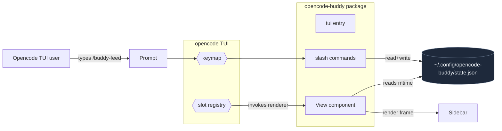

# opencode-buddy v0.3.4

## What's in this release

TUI plugin with full sidebar integration. The buddy now lives natively in the opencode TUI sidebar — no tmux, no separate process.

### Slash commands

| Command | Effect |
| --- | --- |
| `/buddy-feed` | Feed the buddy (+25 hunger, -5 energy) |
| `/buddy-play` | Play with the buddy (+20 happiness, +5 xp, -5 hunger) |
| `/buddy-rest` | Let the buddy rest (+30 energy) |
| `/buddy` | Show current stats as a toast |
| `/buddy-rename` | Rename (max 20 chars, opens prompt dialog) |
| `/buddy-switch` | Switch species (opens picker, 6 options) |

Slash commands update state directly without going through the LLM — instant feedback.

### Auto-reactions

- `session.idle` → 4 second **celebrating** animation
- `session.error` → 5 second **scared** animation
- Energy < 20 → auto-transition to **sleeping**
- Hunger < 25 → auto-transition to **scared** for 30s

### Postinstall

`npm install -g opencode-buddy` now auto-registers the plugin in both `~/.config/opencode/opencode.json` and `~/.config/opencode/tui.json`. Skip-safe: leaves JSONC files with comments alone.

### Bug fix since 0.3.3

TUI plugin install was failing with `NpmInstallFailedError: An unknown git error occurred`. Root cause: `npa("opencode-buddy/tui")` interprets the spec as a git URL (`github:opencode-buddy/tui`). The fix: use the same `opencode-buddy` spec in both configs. opencode's `resolvePackageEntrypoint` reads the package's `exports` field and picks the right entry based on runtime kind (server vs tui), so the same spec serves both purposes.

## Install

```bash
npm install -g opencode-buddy
# restart opencode
```

The postinstall handles the two config files. If you use JSONC with comments, add the entry manually:

```jsonc
// ~/.config/opencode/opencode.json
{ "plugin": ["opencode-buddy"] }
```

```json
// ~/.config/opencode/tui.json
{ "$schema": "https://opencode.ai/tui.json", "plugin": ["opencode-buddy"] }
```

Requires opencode ≥ 1.15.

## Architecture



## License

MIT
